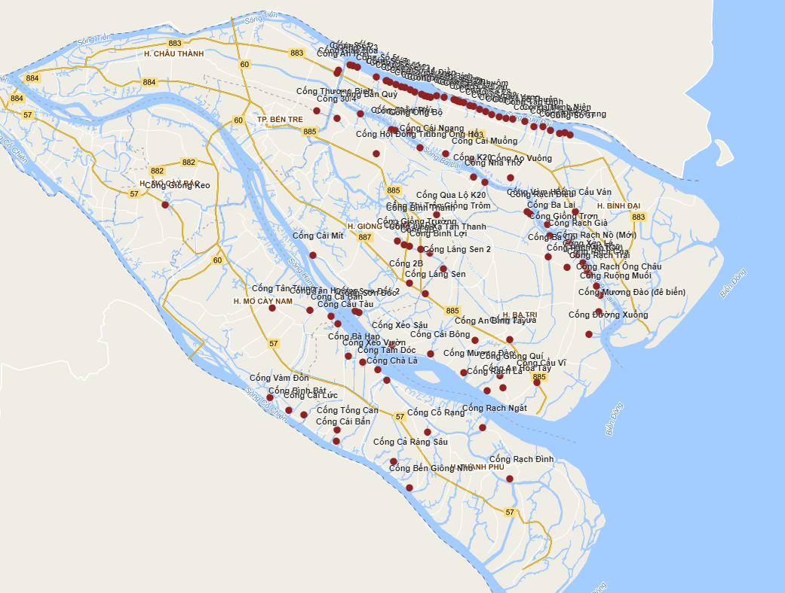
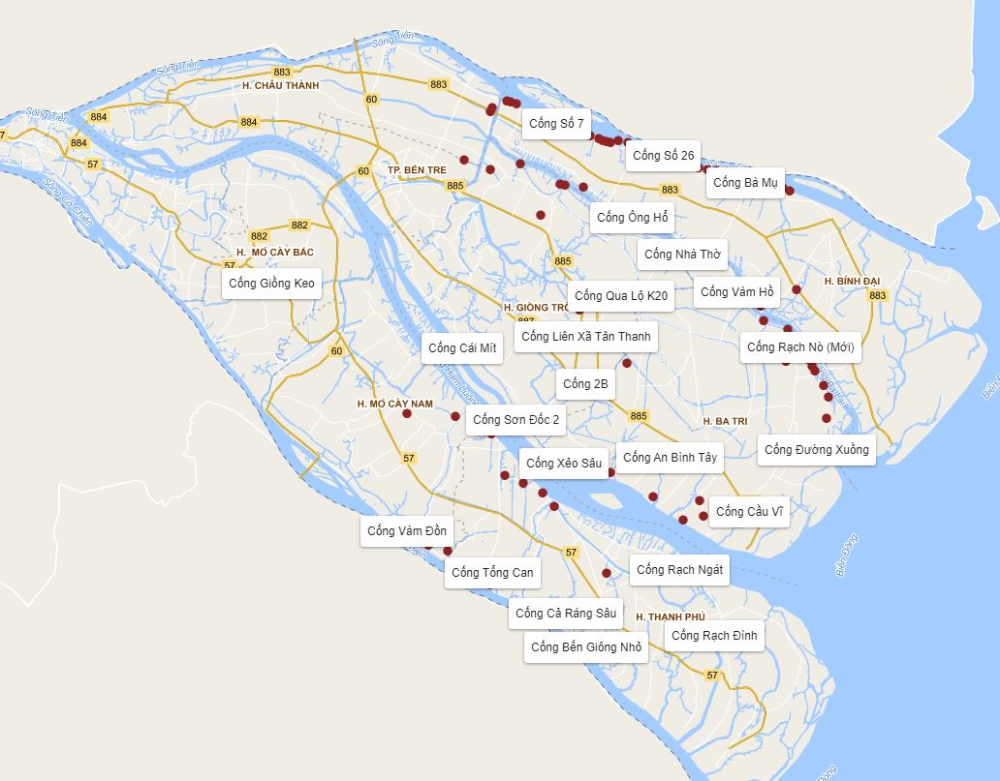
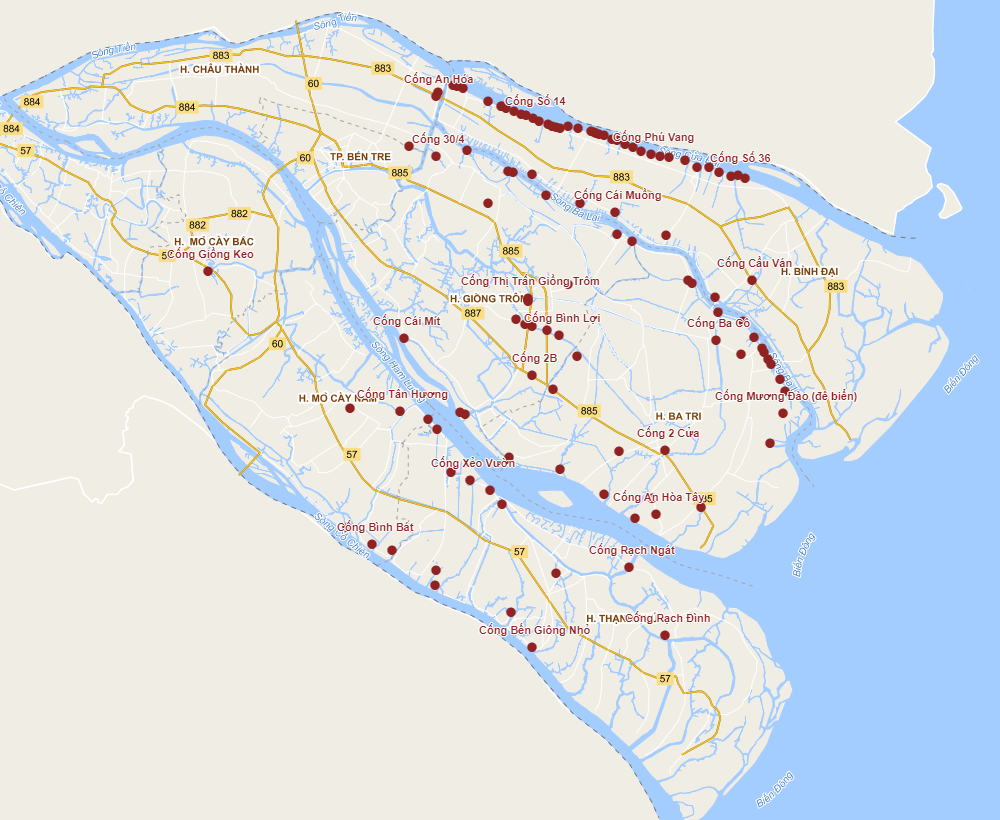

# test_text_collision_leaflet
test_text_collision_leaflet

Demo: <a href="https://soiqualang.github.io/label_collision_leaflet_v2/" target="_blank">https://soiqualang.github.io/label_collision_leaflet_v2/</a>

***

Ex: https://github.com/soiqualang/Leaflet.LabelTextCollision/blob/master/dist/L.LabelTextCollision.js

Thanks <a href="https://github.com/NguyenDucLam">@NguyenDucLam</a> found this repo

https://geovation.github.io/labelgun/examples/leaflet/index.html

> file t1.html

<a href="https://soiqualang.github.io/label_collision_leaflet_v2/t1.html">https://soiqualang.github.io/label_collision_leaflet_v2/t1.html</a>

> file t2.html

<a href="https://soiqualang.github.io/label_collision_leaflet_v2/t2.html">https://soiqualang.github.io/label_collision_leaflet_v2/t2.html</a>

